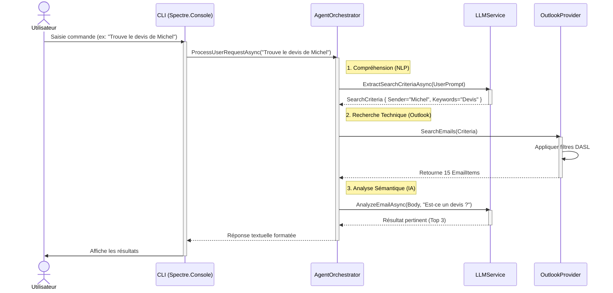
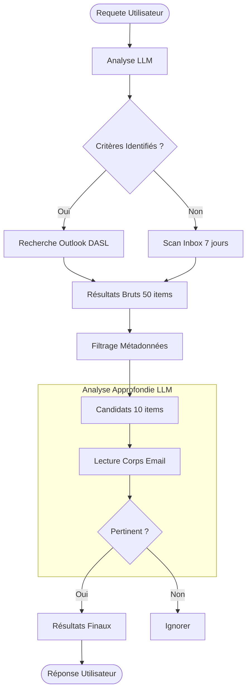
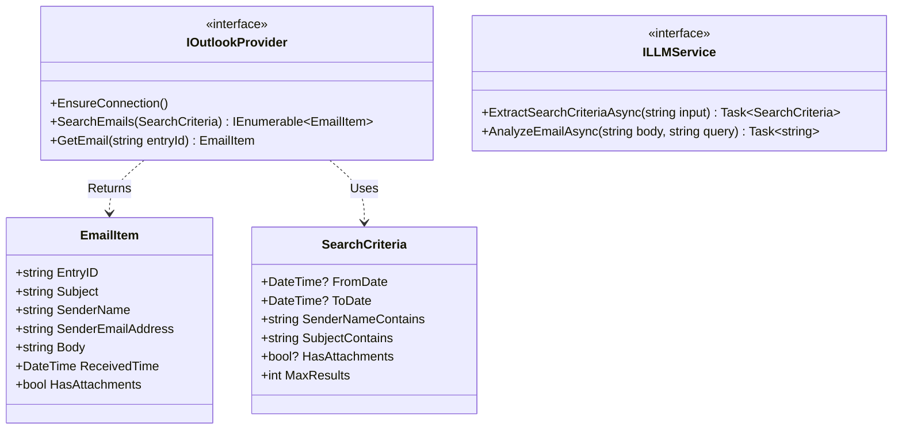

# Workflows du Projet OutlookLocalAI

Ce document modélise les interactions et les flux de données de l'agent OutlookLocalAI.

## 1. Workflow Global de l'Application (Séquence)

Ce diagramme illustre le flux de traitement d'une commande utilisateur, de l'entrée CLI jusqu'à l'exécution dans Outlook et la réponse finale.

## 2. Stratégie de Recherche en Entonnoir (Flowchart)

Ce diagramme détaille la logique de filtrage pour optimiser les performances et la pertinence.

## 3. Architecture des Données (Class Diagram)

Ce diagramme représente les entités principales manipulées par le cœur de l'application.

